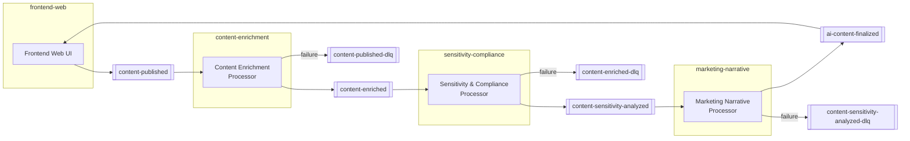

# Event-Driven Architecture Powered by AI Agents

## Proof of Concept – Technical Specification

---

# 1. Business Perspective

This project is an **automated content intelligence pipeline** that helps organizations publish content faster and more safely:

- **Content Enrichment** — When content is published, AI automatically extracts themes, emotional tone, target audience, and keywords — eliminating manual content tagging.
- **Sensitivity & Compliance** — AI evaluates every piece of content for age ratings, regional restrictions, and risk flags before it reaches audiences — reducing legal and reputational exposure.
- **Marketing Asset Generation** — AI instantly produces headlines, taglines, and promotional copy — cutting time-to-market for content promotion.

It transforms raw published content into compliance-checked, audience-ready marketing assets automatically, reducing manual effort and human error across the content lifecycle.

---

# 2. Purpose

This document defines the specification for a Proof of Concept (PoC) of an AI-driven semantic processing pipeline for a streaming platform.

The system processes newly published content through three LLM-based event processors. Each processor consumes a Kafka topic, enriches the event using an LLM agent implemented with LangChain4j, and republishes the accumulated message to the next topic. A web UI module allows users to submit content to the pipeline and view finalized results.

All components:

* Use Java 25
* Use Quarkus
* Follow BCE (Boundary–Control–Entity) architecture
* Communicate exclusively via Kafka
* Accumulate previous agent results in the event payload

The final output is published to a Kafka topic for downstream systems.

---

# 3. High-Level Architecture

Flow of events:

content-published
→ Content Enrichment Processor
→ content-enriched
→ Sensitivity & Compliance Processor
→ content-sensitivity-analyzed
→ Marketing Narrative Processor
→ ai-content-finalized
→ Frontend Web UI

All communication between components is asynchronous and topic-based. No synchronous HTTP calls are allowed between processors.



---

# 4. Architectural Principles

## 3.1 Event-Driven Choreography

* No central orchestrator.
* Each processor consumes exactly one topic and produces exactly one topic.
* Processors are independently deployable.

## 3.2 Event-Carried State Accumulation

* Each processor appends its result to the existing payload.
* Previous fields must not be modified.
* Events must be immutable.
* Correlation is based on contentId.

## 3.3 Immutability

Java 25 records must be used for domain entities and event models.

---

# 5. Kafka Topics

| Topic                            | Producer              | Consumer              |
| -------------------------------- | --------------------- | --------------------- |
| content-published                | Frontend Web UI       | Enrichment Processor  |
| content-enriched                 | Enrichment Processor  | Sensitivity Processor |
| content-sensitivity-analyzed     | Sensitivity Processor | Marketing Processor   |
| ai-content-finalized             | Marketing Processor   | Frontend Web UI       |
| content-published-dlq            | Enrichment Processor  | —                     |
| content-enriched-dlq             | Sensitivity Processor | —                     |
| content-sensitivity-analyzed-dlq | Marketing Processor   | —                     |

---

# 6. Event Model

## 5.1 Initial Event

Topic: content-published

| Field | Type | Description |
| --- | --- | --- |
| `contentId` | `string` | Unique identifier for the content item (UUID) |
| `title` | `string` | Display title of the content |
| `description` | `string` | Synopsis or summary of the content |
| `genre` | `string` | Content genre (e.g. Thriller, Drama, Sci-Fi) |
| `region` | `string` | Target region or market (e.g. GLOBAL, US, DE) |
| `timestamp` | `string` | ISO-8601 publication timestamp |

Example payload:

```json
{
  "contentId": "S123",
  "title": "Shadow District",
  "description": "A political thriller set in a dystopian city.",
  "genre": "Thriller",
  "region": "GLOBAL",
  "timestamp": "2026-03-01T10:00:00Z"
}
```

---

# 7. Agent Processors

---

# 7.1 Content Enrichment Processor

## Input Topic

content-published

## Output Topic

content-enriched

## Responsibilities

* Analyze description and metadata
* Identify:

  * Narrative themes
  * Emotional tone
  * Audience profile
  * Advanced keywords
* Append enrichment data to payload

## Output Structure

The `enrichment` object appended to the payload:

| Field | Type | Description |
| --- | --- | --- |
| `enrichment.themes` | `string[]` | Narrative themes identified in the content (e.g. corruption, moral conflict) |
| `enrichment.emotionalTone` | `string` | Overall emotional tone of the content (e.g. dark suspense, uplifting) |
| `enrichment.audienceProfile` | `string` | Suggested target audience segment (e.g. adults 25-45) |
| `enrichment.keywords` | `string[]` | Advanced keywords extracted for indexing and discovery |

```json
{
  "contentId": "S123",
  "title": "...",
  "description": "...",
  "genre": "...",
  "region": "...",
  "timestamp": "...",
  "enrichment": {
    "themes": ["corruption", "moral conflict"],
    "emotionalTone": "dark suspense",
    "audienceProfile": "adults 25-45",
    "keywords": ["political intrigue", "power struggle"]
  }
}
```

---

# 7.2 Sensitivity & Compliance Processor

## Input Topic

content-enriched

## Output Topic

content-sensitivity-analyzed

## Responsibilities

* Evaluate regulatory and cultural sensitivity risks
* Suggest:

  * Age rating
  * Region-specific restrictions
  * Sensitive content flags
* Use enrichment context as input

## Output Structure

The `sensitivity` object appended to the payload:

| Field | Type | Description |
| --- | --- | --- |
| `sensitivity.ageRatingSuggested` | `string` | Recommended age classification (e.g. 12+, 16+, 18+) |
| `sensitivity.sensitiveRegions` | `string[]` | Regions where the content may require restriction or review |
| `sensitivity.riskFlags` | `string[]` | Specific sensitivity concerns identified (e.g. political corruption theme) |

```json
{
  "...": "previous fields",
  "sensitivity": {
    "ageRatingSuggested": "16+",
    "sensitiveRegions": ["DE", "IN"],
    "riskFlags": ["political corruption theme"]
  }
}
```

---

# 7.3 Marketing Narrative Processor

## Input Topic

content-sensitivity-analyzed

## Output Topic

ai-content-finalized

## Responsibilities

* Generate:

  * Global marketing headline
  * Region-adapted headlines
  * Tagline
  * Short promotional description
* Consider:

  * Enrichment metadata
  * Sensitivity constraints

## Output Structure

The `marketing` object appended to the payload:

| Field | Type | Description |
| --- | --- | --- |
| `marketing.headlineGlobal` | `string` | Primary marketing headline for global distribution |
| `marketing.tagline` | `string` | Short punchy tagline for promotional use |
| `marketing.shortDescription` | `string` | Brief promotional description for listings and previews |

```json
{
  "...": "previous fields",
  "marketing": {
    "headlineGlobal": "In a city of shadows, trust is the ultimate risk.",
    "tagline": "Power hides in the dark.",
    "shortDescription": "A suspense thriller about corruption and survival."
  }
}
```

The final topic ai-content-finalized contains the fully accumulated event.

---

# 7.4 Frontend Web UI

## Input Topic

ai-content-finalized

## Output Topic

content-published

## Responsibilities

* Accept user-submitted content via a web form (title, description, genre, region)
* Publish the submitted content as a `ContentPublishedEvent` to `content-published` to start the pipeline
* Consume `ai-content-finalized` events and display them in a results table
* Serve a server-side rendered UI using Qute templates

## Notes

* Events are held in an in-memory store (`ContentStore`) — no persistence between restarts
* Accessible at http://localhost:9095 when running in Docker Compose

---

# 8. BCE Architecture Requirements

Each processor must follow BCE.

## 7.1 Boundary Layer

* Kafka consumer (Reactive Messaging)
* Kafka producer
* Message validation
* Serialization and deserialization
* Exception handling mapping to DLQ

## 7.2 Control Layer

* Orchestrates:

  * Input validation
  * Invocation of LangChain4j agent
  * Mapping between entity models and prompt models
  * Fault tolerance handling
* Contains workflow logic

## 7.3 Entity Layer

* Immutable domain records
* Event payload models
* Agent result models
* No infrastructure dependencies

---

# 9. LangChain4j Requirements

Each processor must:

* Use the Quarkus LangChain4j extension
* Define a typed AI interface
* Use structured JSON output
* Configure:

  * Model name
  * Temperature
  * Timeout
  * Max tokens
* Validate structured response before publishing

Example conceptual interface:

```java
@AiService
public interface ContentEnrichmentAgent {
    EnrichmentResult analyze(ContentInput input);
}
```

---

# 10. Fault Tolerance

Each processor must implement:

* Retry with exponential backoff
* Circuit breaker
* Timeout configuration
* Dead Letter Topic for unrecoverable failures

Idempotency must be guaranteed by:

* Using contentId as correlation key
* Avoiding mutation of previous payload fields

---

# 11. Non-Functional Requirements

* Asynchronous processing only
* Independent deployability
* Simple logging
* Health endpoints
* Metrics exposure
* Observability integration
* Configurable LLM provider
* Token usage monitoring per processor

---

# 12. PoC Scope Limitations

For this Proof of Concept:

* No schema registry required
* No vector database integration
* No multi-region routing logic
* No external orchestration service
* Single Kafka cluster

---

# 13. Expected Outcome

The final topic ai-content-finalized must contain:

* Original content metadata
* Narrative enrichment
* Sensitivity analysis
* Marketing assets

This topic can be consumed by:

* The `frontend-web` UI (included in this PoC)
* Content management dashboards
* Notification systems
* Analytics pipelines

---

# 14. Success Criteria for PoC

The PoC is considered successful if:

* All three processors can be deployed independently.
* Events flow correctly across topics.
* Each processor appends structured output.
* The final event contains accumulated results from all agents.
* The pipeline demonstrates cooperative LLM processing through Kafka.

---